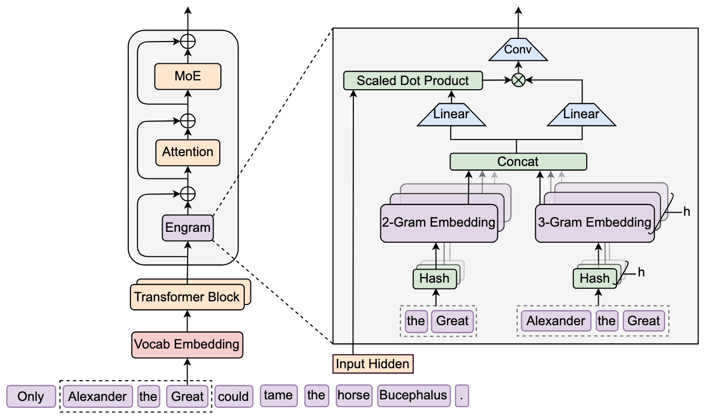
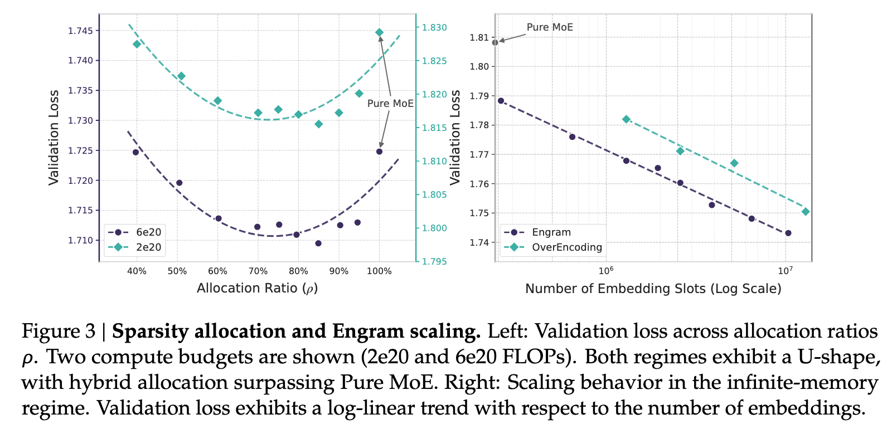
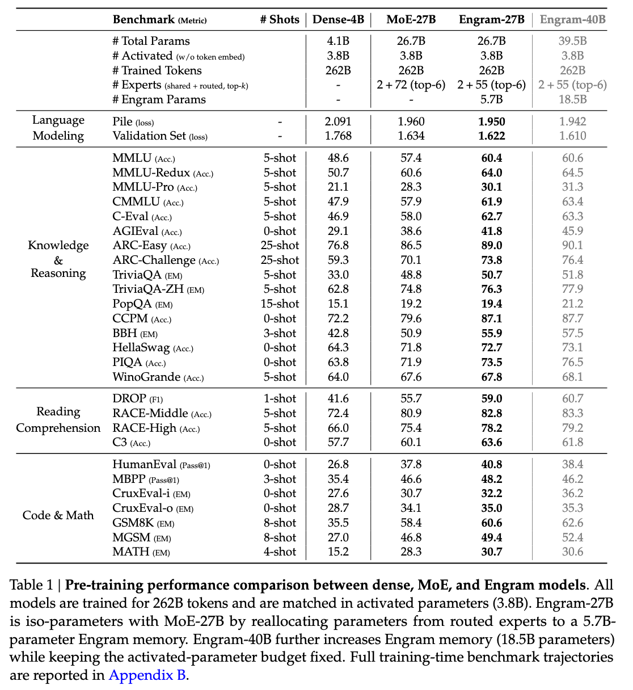
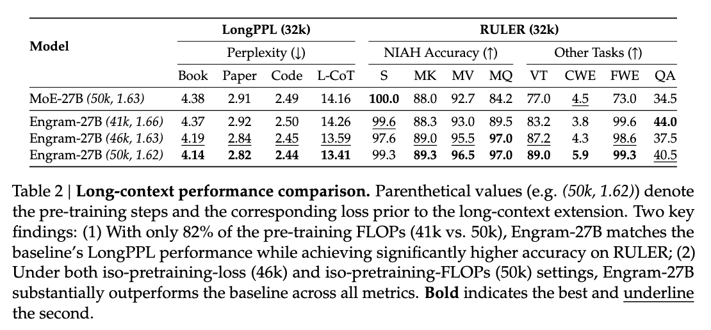
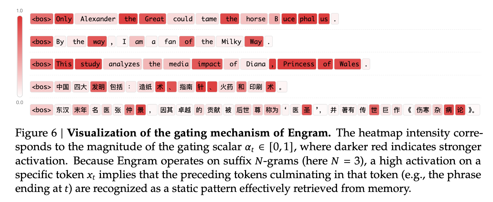

<!-- markdownlint-disable first-line-h1 -->
<!-- markdownlint-disable html -->
<!-- markdownlint-disable no-duplicate-header -->

<div align="center">
  
</div>
<hr>
<div align="center" style="line-height: 1;">
  <a href="https://www.deepseek.com/"></a>
  <a href="https://chat.deepseek.com/"></a>
  <a href="https://huggingface.co/deepseek-ai"></a>
  <br>
  <a href="https://discord.gg/Tc7c45Zzu5"></a>
  <a href="https://github.com/deepseek-ai/DeepSeek-V2/blob/main/figures/qr.jpeg?raw=true"></a>
  <a href="https://twitter.com/deepseek_ai"></a>
  <br>
  <a href="LICENSE" style="margin: 2px;">
    
  </a>
  <br>
</div>

## 1. Introduction

This repository contains the official implementation for the paper: **[Conditional Memory via Scalable Lookup: A New Axis of Sparsity for Large Language Models](Engram_paper.pdf)**.

> **Abstract:** While Mixture-of-Experts (MoE) scales capacity via conditional computation, Transformers lack a native primitive for knowledge lookup. To address this, we explore **conditional memory** as a complementary sparsity axis, instantiated via **Engram**, a module that modernizes classic $N$-gram embeddings for $\mathcal{O}(1)$ lookup.

**Key Contributions:**
- **Sparsity Allocation:** We formulate the trade-off between neural computation (MoE) and static memory (Engram), identifying a U-shaped scaling law that guides optimal capacity allocation.
- **Empirical Verification:** Under strict iso-parameter and iso-FLOPs constraints, the Engram-27B model demonstrates consistent improvements over MoE baselines across knowledge, reasoning, code and math domains.
- **Mechanistic Analysis:** Our analysis suggests that Engram relieves early layers from static pattern reconstruction, potentially preserving effective depth for complex reasoning.
- **System Efficiency:** The module employs deterministic addressing, enabling the offloading of massive embedding tables to host memory with minimal inference overhead.


## 2. Architecture

The Engram module augments the backbone by retrieving static $N$-gram memory and fusing it with dynamic hidden states. The architecture is shown below ([drawio provided](drawio/Engram.drawio)):

<p align="center">
  
</p>

## 3. Evaluation

### Scaling Law
<p align="center">
  
</p>

---

### Large Scale Pre-training
<p align="center">
  
</p>

---

### Long-context Training
<p align="center">
  
</p>


## 4. Case Study of Engram
<p align="center">
  
</p>

## 5. Quick Start

We recommend using Python 3.8+ and PyTorch.
```bash
pip install torch numpy transformers sympy
```
We provide a standalone implementation to demonstrate the core logic of the Engram module:
```bash
python engram_demo_v1.py
```

> ⚠️ **Note:** The provided code is a demonstration version intended to illustrate the data flow. It mocks standard components (like Attention/MoE/mHC) to focus on the Engram module. 


## 6. License
The use of Engram models is subject to [the Model License](LICENSE).

## 7. Contact

If you have any questions, please raise an issue or contact us at [service@deepseek.com](mailto:service@deepseek.com).